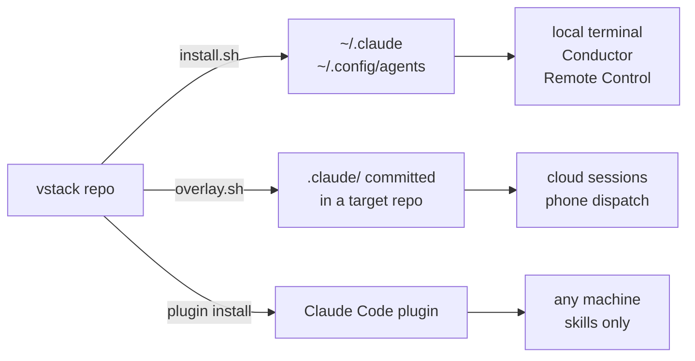

# vstack

**A Claude Code setup where the skills fire on their own.** 26 skills, 8 agents, 14
commands, and the session hook that routes a situation to the right skill without you typing a
slash command.

[](https://github.com/itsvedantkumar/vstack/actions/workflows/verify.yml)
[](LICENSE)
[](#install)

Ask for a README and the writing skills load. Hand it a TypeScript file and the type-safety
skill loads. Say "audit this three ways" and it fans out three subagents in one message. None
of that needs a command, and the repo ships a test that proves it still happens.

```bash
curl -fsSL https://raw.githubusercontent.com/itsvedantkumar/vstack/main/bootstrap.sh | bash
```

That takes a machine with nothing on it to a working setup: Homebrew, the CLI tools,
Conductor, the Claude Code CLI, then this config.

## Install

Three ways in, depending on how much you want.

**A machine with nothing on it.** Installs Homebrew, the CLI tools, Conductor, the Claude Code
CLI, and then this config.

```bash
curl -fsSL https://raw.githubusercontent.com/itsvedantkumar/vstack/main/bootstrap.sh | bash
```

That line gives this repository, and whatever it points at next, immediate shell on your
machine. If you would rather not, read it first and pin a release instead of tracking `main`:

```bash
curl -fsSL https://raw.githubusercontent.com/itsvedantkumar/vstack/v1.4.0/bootstrap.sh -o bootstrap.sh
less bootstrap.sh                       # it is 90 lines
VSTACK_REF=v1.4.0 bash bootstrap.sh     # clone that tag, not main
```

`VSTACK_REF` pins which commit or tag gets installed. Without it the bootstrap follows `main`,
which means a push to this repo reaches your machine the next time you run it.

**The tools are already there.** Installs the config alone.

```bash
git clone https://github.com/itsvedantkumar/vstack.git
cd vstack
./install.sh
```

**Only the skills.** Adds the skills, subagents, commands, and the routing hook, and touches
nothing else on the machine.

```bash
claude plugin marketplace add itsvedantkumar/vstack
claude plugin install vstack@vstack
```

### What the bootstrap installs

`setup-machine.sh` works in tiers and checks each tool before installing it, so a second run
costs seconds. Run `./setup-machine.sh --check` to audit a machine without changing it.

| Tier | Tools | For |
|---|---|---|
| core | `git`, `jq`, `ripgrep`, `fd`, `gh`, `node`, `bun`, `uv` | agent tooling and this installer |
| bundled | `npm`, `npx`, `pnpm`, `yarn`, `python3` | verified rather than installed: they arrive with node or the Xcode tools |
| claude | Claude Code CLI | the agent itself |
| conductor | Conductor Mac app | running several agents in parallel, macOS only |
| plugins | claude-mem, typescript-lsp | memory layer and language tooling |
| deploy | `vercel`, `wrangler` | the autonomous deploy chain |
| security | `trivy`, `gitleaks`, `nmap`, `nuclei` | the `/security` command, add `--with-security` |

Only `git` and `jq` decide the exit code. A missing `nuclei` is not a broken machine.

Two things it cannot do for you. The Xcode command line tools need a GUI prompt, so it tells
you to run `xcode-select --install` and carries on. OWASP ZAP is a large Java app and is left
to you.

Preview any install with `./install.sh --dry-run`. It backs up every file it overwrites to
`~/.config/agents/backups/install-<timestamp>/`, and it never overwrites `secrets.env`.

Installed as a plugin, the session hook runs in `VSTACK_PROFILE=skills` mode and injects the
routing block alone. The token, delegation, and autonomy rules are one person's operating
policy, so a marketplace install does not get them. `install.sh` applies the full block,
because there you asked for it.

## Three lanes, and which one reaches where

Config reaches a session by one of three routes. Most confusion about this setup is really
confusion about which lane something is in.

| Lane | Command | Lands in | Reaches |
|---|---|---|---|
| global | `./install.sh` | `~/.claude`, `~/.config/agents` | every local session on this machine |
| per-repo overlay | `./overlay.sh <repo>` | committed `.claude/` + `.conductor/` in that repo | Conductor workspaces and cloud sandboxes, which have no `~/.claude` |
| plugin marketplace | `claude plugin install vstack@vstack` | Claude Code's plugin cache | anyone, on any machine, without cloning |

The overlay lane is the one people miss. A cloud sandbox clones your repo and starts from
nothing — no home directory config of any kind. If the skills are not committed in that repo,
that session does not have them. `bin/doctor` fails when an active repo has no overlay, and it
finds those repos through their Conductor workspaces rather than a hardcoded list of paths.

The plugin lane is deliberately the narrowest. It ships the skills, subagents, commands and the
routing hook, and stops there. The token, delegation and autonomy rules in the other two lanes
are one person's operating policy and have no business arriving with a skill pack a stranger
installed.

### Remote Control and the phone

The lanes say where config lands; sessions differ in what they can read from there:

| Source | Local terminal | Conductor | Remote Control | Cloud session / routine (phone) |
|---|:--:|:--:|:--:|:--:|
| `~/.claude/**` (user scope) | ✅ | ✅ | ✅ runs on your Mac | ❌ sandbox has no `~/.claude` |
| `~/.zshenv` exports | ✅ | ✅ | ✅ | ❌ |
| `shell/claude-parity.zsh` wrapper | ✅ | n/a | ❌ never goes through your zsh | ❌ |
| committed `.claude/` overlay | ✅ | ✅ | ✅ | ✅ the only source a sandbox sees |

Two environment variables look like harmless telemetry switches and silently kill the Remote
Control column: `CLAUDE_CODE_DISABLE_NONESSENTIAL_TRAFFIC` and `DISABLE_GROWTHBOOK` both gate
feature-flag evaluation, which Remote Control needs to register. With either set,
`claude doctor` reports "Remote Control rollout could not be verified" and phone dispatch
stops working. `bin/doctor` fails when the first is set.

Which settings keys may enter the overlay at all is decided in
[`claude/settings.project-keys`](claude/settings.project-keys), which records why each key
earns its place and names the ones deliberately kept in user scope. Hook commands in the
overlay use `$CLAUDE_PROJECT_DIR`-relative paths on purpose: an absolute `/Users/...` path
exits 127 on every hook event inside a sandbox.

## What you get

| Component | Count | Installs to |
|---|---|---|
| Skills | 26 | `~/.claude/skills/` |
| Subagents | 8 | `~/.claude/agents/` |
| Commands | 14 | `~/.claude/commands/` |
| Hooks | 5 | `~/.claude/hooks/` |
| CLI wrappers | 7 | `~/.config/agents/bin/` |
| MCP servers | 2 | merged into `~/.claude.json` |
| Global directives | `CLAUDE.md` | `~/.claude/CLAUDE.md` |

Counts regenerate with `find claude/skills -maxdepth 1 -mindepth 1 -type d | wc -l` and the
matching `ls` per directory.

## The skills

14 workflow skills, each triggered by a situation rather than a command.

| Skill | Fires when |
|---|---|
| `swarm` | work splits into independent parts, or approaches should be raced |
| `blast-radius` | you are shipping a risky change and want to know what it breaks |
| `interrogate` | code is going in that only one reviewer, or none, has seen |
| `create-verification-skill` | a repo has no scripted way to prove it works |
| `maintain-verification-skill` | that proof has drifted from the app |
| `show-me-your-work` | long or overnight work a human reviews after stepping away |
| `reflect` | you were corrected, or found a workflow worth keeping |
| `technical-writing` | writing docs, RFCs, READMEs, PR bodies, commit messages |
| `unslop` | any prose at all, to cut the AI tells |
| `typescript-best-practices` | reading, writing, or reviewing `.ts` or `.tsx` |
| `ui-iterate` | editing UI files when a dev server runs: screenshot, critique, fix before declaring done |
| `agent-browser` | screenshotting or driving a dev server when the shared Chrome is unavailable or contended |
| `impeccable` | building or polishing UI where visual quality matters: typography, motion, spacing, design modes |
| `component-registry` | about to hand-write a UI component in a React/Tailwind repo |

Eight principles load when the moment matches and apply a rule rather than run a procedure.

| Principle | Applies when |
|---|---|
| `prove-it-works` | before declaring anything done |
| `fix-root-causes` | debugging, or reaching for a `try`/`except` guard |
| `encode-lessons-in-structure` | the same correction lands twice |
| `type-system-discipline` | designing types or a function signature |
| `boundary-discipline` | wiring validation, error handling, or an adapter |
| `make-operations-idempotent` | writing cron jobs, retries, anything that can restart |
| `sequence-verifiable-units` | sweeps, migrations, stacked commits |
| `build-the-lever` | the same manual edit or check keeps repeating |

Four more cover the planning chain: `brainstorming`, `writing-plans`,
`test-driven-development`, and `executing-plans`.

## Why they fire

Installing a skill does not make it trigger. Three things have to be true at once, and the
third is invisible when it breaks:

1. The skill must not carry `disable-model-invocation`.
2. Its description must name a situation, because situations are what the model matches.
3. The description must survive the skill listing. Set `skillListingBudgetFraction` too low
   for the number of installed skills and Claude Code truncates descriptions, cutting exactly
   the trigger phrases that make matching work. Nothing errors. The skills just stop firing.

Even with all three right, something has to connect a situation to a skill.
`claude/hooks/inject-session-context.sh` carries that routing block and runs at every session
start.

`tests/auto-trigger.sh` proves it still works. It runs real prompts through the CLI and checks
which skills fired. Strip the routing block and cases fail, which is how you know the test is
worth having. [docs/how-skills-fire.md](docs/how-skills-fire.md) has the measurements.

## Verification that blocks completion

Put an executable `.claude/verify.sh` in a repo and the `verify-gate.sh` Stop hook runs it
before an agent may say the work is done. A non-zero exit blocks the claim and returns the
failure output as the reason. The gate stops after three blocks per session, so an overnight
run cannot loop forever.

This repo gates itself the same way:

```bash
./.claude/verify.sh
```

It checks shell syntax, JSON validity, skill frontmatter and description lengths, hardcoded
home paths, committed credentials, infrastructure identifiers, the settings merge program, and
a full `install.sh --dry-run`.

To add the same gate to another repo, ask Claude for verification there and the
`create-verification-skill` skill writes one that fits the stack.

## Day-to-day

```bash
vstack update            # fetch, review the incoming script diff, confirm, reinstall
vstack doctor            # health check
vstack doctor --drift    # has anything been edited in place?
vstack overlay <repo>    # commit the config into another repo
vstack verify            # run the gate
vstack uninstall --list  # show restorable backups
```

`doctor --drift` answers the question that costs you work: does the installed state still
match the repo it came from? Editing `~/.claude` directly works right up until the next
`install.sh` overwrites it.

`uninstall.sh` restores from those backups. It refuses to act without `--yes`, never touches
`secrets.env`, and never deletes a symlinked skill, because those belong to Claude Code and
its plugins.

## Where the config goes



A cloud session clones a repo into a sandbox with no access to your home directory, so a
committed `.claude/` directory is the only config it can read. That is what `overlay.sh` is
for. Run it in any repo you dispatch cloud work to.

**`CLAUDE_CONFIG_DIR` is honoured.** Set it and the install goes there instead of `~/.claude`,
including the hook paths written into `settings.json` and the `.claude.json` MCP entries. If
you keep separate profiles, or run in a container that puts config somewhere else, set it
before installing and everything follows.

**Shells.** The environment lane — the 1h prompt cache, tool concurrency, streaming, task
support — is written to `.zshenv` and, for bash users, to `.bashrc`. The `claude` wrapper is
zsh only: it is written in zsh and cannot be sourced by bash, so on a bash machine you get the
environment without the wrapper, and `install.sh` says so when it runs.

`tests/install-matrix.sh` runs the installer into throwaway HOMEs and asserts the resulting
tree: default, `CLAUDE_CONFIG_DIR`, a home path with a space, no `jq`, a bash user, a second run
for idempotency, both uninstall paths, and an install over a home that already holds the user's
own skills, agents, settings and MCP servers. Two more cases exercise the curl bootstrap and the
plugin marketplace against the published repo, and skip with a reason when offline. It runs on
Linux, macOS, Windows and Alpine in CI every push, and never touches your real home directory,
so it is safe to run on the machine you work on.

## Credentials

`install.sh` copies `secrets.env.example` to `~/.config/agents/secrets.env` with mode 600 when
that file does not exist, and leaves it alone when it does. Fill in the variables you use. The
MCP wrappers in `bin/` source it before they exec.

The example names the Anthropic key `ANTHROPIC_SDK_API_KEY` on purpose. Claude Code reads
`ANTHROPIC_API_KEY` and bills API credits against it instead of your subscription, so the
shell wrapper strips that name and `doctor` fails if it is set.

Two settings stay opt-in. `permissions.defaultMode=bypassPermissions` and
`skipDangerousModePermissionPrompt` stop Claude asking before it acts. Pass
`./install.sh --bypass-permissions` if you want them.

## Conductor

`.conductor/settings.toml` makes a Conductor workspace install this bundle as its setup step
and puts the verification gate behind a run button.

`./overlay.sh <repo>` writes the same file into your other repos, with a setup step that pulls
vstack in through `bootstrap.sh`. Cloud workspaces start from a bare Linux sandbox with no
`~/.claude`, so without it they get none of this. If the repo already has a
`.conductor/settings.toml`, `overlay.sh` leaves it alone and prints the lines to merge.

## Layout

```
claude/          settings, CLAUDE.md, statusline, hooks, agents, commands, skills
conductor/       user-level Conductor defaults
bin/             CLI wrappers installed to ~/.config/agents/bin
shell/           zsh wrapper and env snippet
mcp/             MCP server definitions merged into ~/.claude.json
tests/           the auto-trigger regression suite
install.sh       user-scope install, idempotent
overlay.sh       copies the config into a repo so cloud sessions get it
setup-machine.sh installs the tools a fresh machine lacks
bootstrap.sh     clone, setup-machine, and install in one line
```

## What this does not do

**Skill dispatch is a model decision, not a branch.** Routing raises the odds; it does not
guarantee them. `tests/auto-trigger.sh` allows three attempts per case for exactly this reason,
and `feature-chain` lands on the first attempt only about half the time. The suite prints which
attempt each case landed on, so erosion shows up before a case goes fully red. Treat a skill
firing as likely, not certain.

**`skillOverrides` cannot suppress a skill that comes from a plugin.** Claude Code resolves the
listing mode before it reads the setting for plugin-supplied skills. All 17 bundled overrides
here work; the plugin ones did not, which is why 38 of them were deleted. With `claude-mem`
enabled that costs about 992 tokens of listing every session, and there is no setting that
recovers it. [docs/how-skills-fire.md](docs/how-skills-fire.md) has the measurement.

**The Stop-hook gate is opt-in per repo, by content hash.** A freshly cloned repo's
`.claude/verify.sh` never runs until you run `vstack trust` there. That is deliberate — an
executable in someone else's repo running automatically on every Stop is a handout of code
execution — but it does mean the gate is inert until you arm it, and needs re-arming after you
edit it.

**`curl | bash` is a real trust decision, and pinning is the only mitigation offered.** The
one-liner runs whatever `main` holds at the moment you run it, then `setup-machine.sh` runs
Homebrew's, Bun's, uv's and Anthropic's installers, each fetched the same way. Nothing here is
digest-pinned or signature-verified, so a compromise of this account, of DNS or TLS in front of
any of those hosts, or of any chained installer becomes shell on your machine. `VSTACK_REF`
pins this repo to a tag you have read; it does nothing for the installers downstream. The
cloud-sandbox lane is pinned by default because a compromise there would reach every workspace
at once — `overlay.sh` writes a specific reviewed commit into `.conductor/settings.toml`.

**`vstack update --yes` skips the review.** An interactive update fetches, shows the incoming
commits and the full diff of every script the gate executes, and asks before merging and
re-recording trust hashes; without a terminal it refuses instead of assuming. The `--yes`
flag exists for automation, and anything automated enough to use it is back to trust-on-pull.

**macOS, Linux and Windows all run in CI on every push.** The install matrix runs on
`ubuntu-latest`, `macos-latest` and `windows-latest`, and Linux additionally installs for real
and fires the hooks. Windows means Git Bash: that is what `shell: bash` selects on a Windows runner, and it is what
CI actually exercises. WSL is Linux and the Linux jobs cover that shape, but no job runs inside
WSL itself and none tests a drive letter other than C:, so treat those as untested rather than
supported. Native PowerShell is not
a target: everything here is a shell script and none of it is being ported.

Two things are still macOS-only, and neither is the installer. Conductor is a Mac app, so the
`.conductor` lanes only mean something there. The `claude` shell wrapper is written in zsh and
bash cannot source it, so a bash user gets the environment without the wrapper and the
installer says so as it runs.

Nothing here installs a scheduled job on any platform: `install.sh` writes no launchd plist, no
systemd unit and no scheduled task. Scheduling is yours to arrange.

**The counts in this README are enforced, the prose is not.** `.claude/verify.sh` check 12
reads every number back and fails on a mismatch. Nothing checks whether a sentence is still
true.

## Docs

- [How skills fire](docs/how-skills-fire.md), and the measurements behind the routing block
- [Skill attribution](claude/skills/ATTRIBUTION.md), per-skill source and license
- [MCP servers](mcp/README.md), what ships globally and how to scope one to a project
- [The auto-trigger test](tests/README.md), how to run and extend it, and how the gate proves
  each of its own checks can fail
- [Why these skills](docs/provenance/pstack-audit.md), the fit-and-benefit audit of all 44 pstack
  skills that decided which 18 were worth porting
- [Changelog](CHANGELOG.md), with the measurements behind each release

## Credits

18 skills are ported from [pstack](https://github.com/cursor/plugins), 4 come from
[Superpowers](https://github.com/obra/superpowers), 1 from
[Impeccable](https://github.com/pbakaus/impeccable) by Paul Bakaus (Apache 2.0), 1 from
[agent-browser](https://github.com/vercel-labs/agent-browser) by Vercel Labs (Apache 2.0),
and 2 are original to this repo (`ui-iterate` and `component-registry`).
Porting adapted them to Claude Code: Cursor model names mapped to Anthropic ones, `Task` calls to
the `Agent` tool, and cloud-only parameters to local execution. Per-skill sources and licenses are
in [ATTRIBUTION.md](claude/skills/ATTRIBUTION.md).
